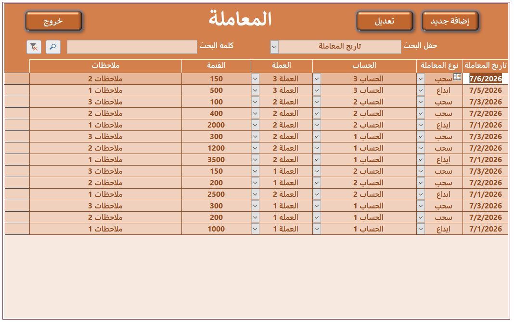
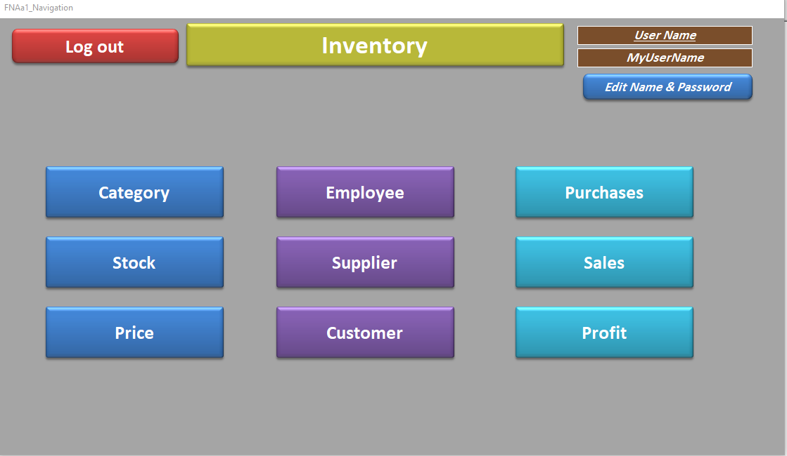

# Hello and Welcome, I'm Ahmed Mubarek!

## I'm Database Developer and Instructor

### Access Database

- <b>Full databases</b>
  - [Applications 2 (Github)](https://github.com/AhmedMubarek696/Full_Access_Databases)
  - [Applications 1 (Behance)](https://www.behance.net/AhmedMubarek696)
  - [Preview Applications (YouTube)](https://www.youtube.com/watch?v=27oOZn82SWQ&list=PLtZl0m5A-CnTL-866CDAXxMRXqpBrrdp1)

- <b>Tutorials</b>
  - [English Tutorials (YouTube)](https://www.youtube.com/watch?v=hrKNkjf50iA&list=PLtZl0m5A-CnS7eprkhJRVT6C3U09BQobw)
  - [Arabic Tutorials (YouTube)](https://www.youtube.com/watch?v=WJiKvlfM5_k&list=PLtZl0m5A-CnRAhBxr70PAwieU23JGn56a)

## 🤳 Connect with me:

[][youtube]

[youtube]: https://www.youtube.com/@AhmedMohammed-gg5kx
 

## Example Applications and Tutorials

<!--
**joshmadakor1/joshmadakor1** is a ✨ _special_ ✨ repository because its `README.md` (this file) appears on your GitHub profile.

Here are some ideas to get you started:

- 🔭 I’m currently working on ...
- 🌱 I’m currently learning ...
- 👯 I’m looking to collaborate on ...
- 🤔 I’m looking for help with ...
- 💬 Ask me about ...
- 📫 How to reach me: ...
- 😄 Pronouns: ...
- ⚡ Fun fact: ...
-->
